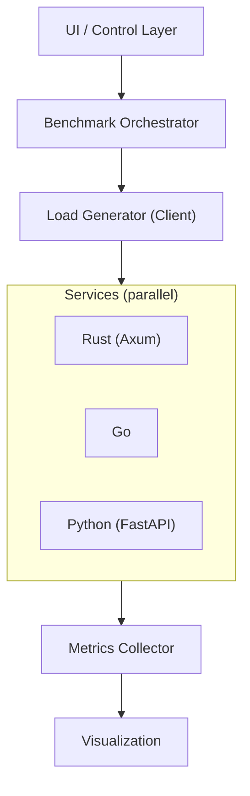

# Architecture

## Overview

This system is designed as a **multi-language, multi-protocol evaluation lab** centered on one canonical service contract.

The core idea:

> Same canonical problem, different implementations/transports, measurable outcomes.

---

## High-Level Architecture



---

## Service Design

Each service follows:

```text
Core Domain
    |
Protocol Adapters
    |
Metrics Instrumentation
```

---

## Key Properties

### 1. Single Logical Service

Each language exposes:

- HTTP
- WebSocket
- gRPC

Simultaneously.

---

### 2. Comparable Contracts

All services:

- accept identical payloads
- return identical responses
- expose equivalent endpoints

---

### 3. Isolated Variables

Only one dimension changes per test:

- language
- protocol
- payload
- concurrency

---

### 4. Dual Workload Model

The system supports two workload types:

- I/O-bound: `/echo` (protocol-focused)
- CPU-bound: `/work/primes` (runtime/concurrency-focused)

This enables comparison across both transport efficiency and compute behavior.

---

## Metrics Flow

```text
Request -> Adapter -> Core -> Response
             |
        Metrics Emit
             |
        Aggregation
             |
        UI / Report
```

---

## Docker Model

All components run in a single Compose stack:

- services
- load client
- orchestrator
- UI

---

## Extensibility

### Add Language

- implement service contract
- expose protocols
- register in compose

### Add Protocol

- implement adapter
- update client
- update metrics tagging

---

## Design Tradeoffs

- simplicity over abstraction
- comparability over idiomatic purity
- reproducibility over raw performance

---

## Future Extensions

- streaming systems (NATS, Kafka)
- distributed deployments
- cross-region latency simulation
